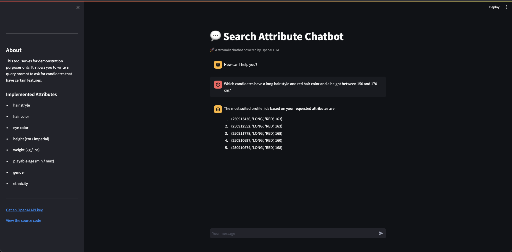

# POC - LLM Search Attributes (Simplified)
The purpose of the POC is to demonstrate a large language model (LLM) based approach to querying a table of profiles and their attributes to get suitable profile ids in return. The frontend allows for a prompt input such as: 

`Which candidates have a long hair style and red hair color and a height between 150 and 170 cm?`

As a result, a list of suitable candidates is the be expected. The result could be visualized as follows:
```
The most suited profile_ids based on your requested attributes are:

1. (250913436, 'LONG', 'RED', 163)
2. (250912552, 'LONG', 'RED', 163)
3. (250911778, 'LONG', 'RED', 168)
4. (250910697, 'LONG', 'RED', 160)
5. (250910674, 'LONG', 'RED', 168)
```


## Architecture
The architecture of the POC consists of three docker compose components. These can be devided into database, api and web frontend. Each component has it's own Dockerfile used as build template. The following frameworks have been used:

- Database: PostgreSQL database (can be accesed through any suitable SQL IDE)
- API: FastAPI 
- App: Langchain + OpenAI
- Web Frontend: Streamlit

:warning: This implementation utilizes the `SQLDatabaseChain` to merge the llm model and a database to avoid the setup of a sql agent. More details can be found [here](https://api.python.langchain.com/en/latest/sql/langchain_experimental.sql.base.SQLDatabaseChain.html).


## Contribute
The following section describes useful information to activly contribute to this POC. This is NOT needed for pure demonstration purposes.


### Project Structure
The porject follows a conventional directory and folder structure with commonly found naming conventions such as api, db and tests for categoization of code in respect to their purpose.

```bash
./root
    |-- api                         Folder for API files.
    |-- docs                        Documentation.
    |-- app                         Source code for backend.
        |-- __data                  Test data.
        |-- db                      Database connector.
        |-- model                   LLM orchestration.
    |-- frontend                    Source folder for web frontend.
    |-- tests                       Tests folder for unit tests.
    |-- env.example                 Local env file.
    |-- Pipfile                     Dependency management.
```


### Local Env Setup
Currently the project is orchestrated soley through python's Pipenv. To activate the environment and install dependencies exectue the following:
```bash
pipenv install 
pipenv install -d 

pipenv shell
```

If necessary, the pythonpath can be set through the following commpand (Ensure you are in the POC's root directory before executing):

```bash
export PYTHONPATH=$(pwd)
```


## Demo
In order to run the application for a demo make a copy of the the `.env.example` file and rename it to `.env`. After that, fill in all necessary variables such as API Keys. Finally you can execude the docker compose file with the following command from the terminal:


```bash
docker-compose up -d
```

After docker-compose started successfully navigate to [http://localhost:8501/](http://localhost:8501/)

