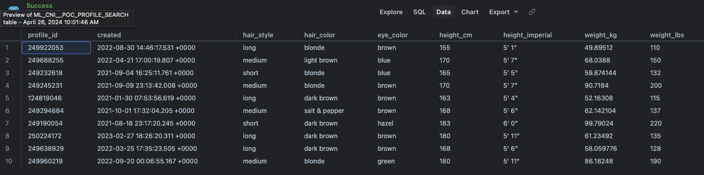
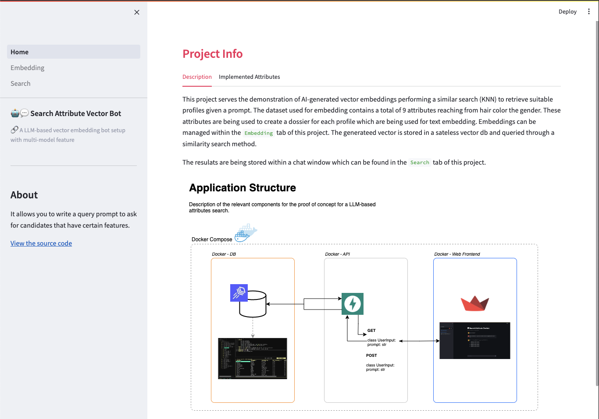
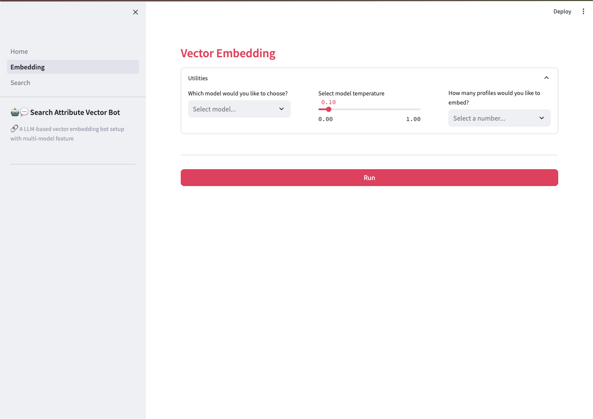
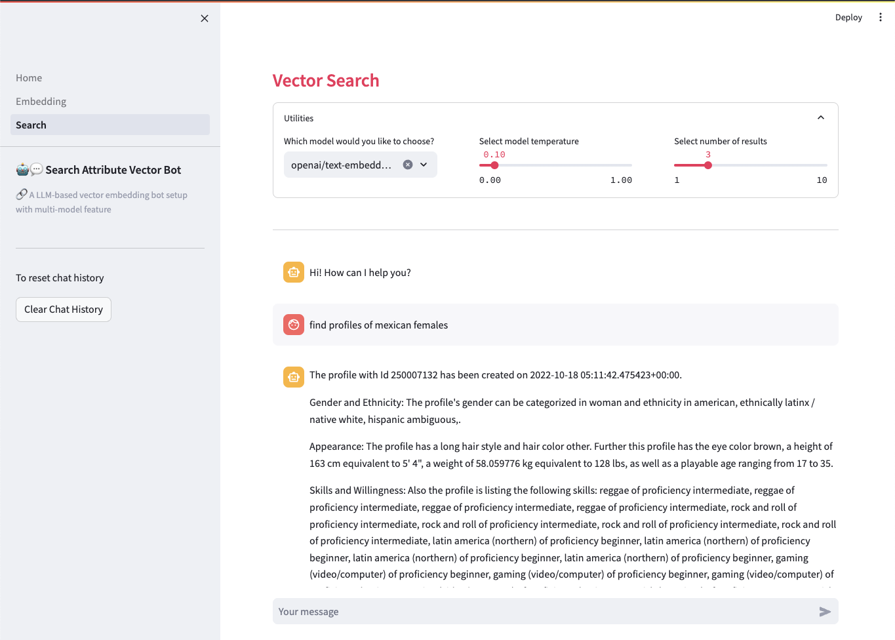

# POC - LLM Search Attributes (Vector-Based)
The purpose of the POC is to demonstrate a large language model (LLM) based approach to querying a table of profiles and their attributes to get suitable profile ids in return. The frontend allows for a prompt input such as: 

```
Which candidates have a long hair style and red hair color and a height between 150 and 170 cm?
```

This prompt is being converted in a vector and compared to vectors embedded in a vector database. For this project a stateless vector db called LanceDB has been used.

As a result, a list of suitable candidates is the be expected. The result could be visualized as follows:
```
The most suited profile_ids based on your requested attributes are:

The profile with Id 249245231 has been created on 2021-09-09 23:13:42.008418+00:00.
Gender and Ethnicity: The profile's gender can be categorized in woman and ethnicity in ambiguous latinx / hispanic, ethnically white.
Appearance: The profile has a medium hair style and hair color blonde. Further this profile has the eye color brown, a height of 170 cm equivalent to 5' 7", a weight of 90.718400 kg equivalent to 200 lbs, as well as a playable age ranging from 25 to 38.
Skills and Willingness: Also the profile is listing the following skills: softball of proficiency intermediate, softball of proficiency intermediate, softball of proficiency intermediate.
Credits: Last it is worth to mention the profile has the following credits: a Commercial with the title Stitch Fix- Fall campaign casted by the director Santiago Valencia where the profile held the role Customer, ...
```


## :triangular_ruler: Architecture
The architecture of the POC consists of three docker compose components. These can be devided into database, api and web frontend. Each component has it's own Dockerfile used as build template. The following frameworks have been used:

- Database: PostgreSQL database (can be accesed through any suitable SQL IDE)
- API: FastAPI 
- App: Langchain + LLM
- Web Frontend: Streamlit


The LLM component is written in a way that makes the LLM model interchangeable and swtichable using Langchain as orchestration framework. By adding more LLM models, they are going to be nativly available to the frontend streamlit application. 


Currently the following models are implemented:
- AWS Bedrock - Titan Text Embedding
- AWS Bedrock - Cohere Text Embed
- OpenAI - Text Embedding Large


## :construction_worker: Contribute
The following section describes useful information to activly contribute to this POC. This is NOT needed for pure demonstration purposes.


### Project Structure
The porject follows a conventional directory and folder structure with commonly found naming conventions such as api, db and tests for categoization of code in respect to their purpose.

```bash
./root
    |-- api                         Folder for API files.
        |-- docs                    Documentation.
        |-- llm_search_app          Source code for backend.
            |-- __data              Test data.
            |-- db                  Database connector.
            |-- model               LLM orchestration.
            |-- agent.py            main executor.
    |-- frontend                    Source folder for web frontend.
    |-- tests                       Tests folder for unit tests.
    |-- env.example                 Local env file.
    |-- Pipfile                     Dependency management.
```


### Local Env Setup
Currently the project is orchestrated soley through python's Pipenv. To activate the environment and install dependencies exectue the following:
```bash
pipenv install 
pipenv install -d 

pipenv shell
```
You can also utilize the docker-compose image to develop within a container orchestrated environment.

If necessary, the pythonpath can be set through the following commpand (Ensure you are in the POC's root directory before executing):

```bash
export PYTHONPATH=$(pwd)
```

### Data Source
To work with high quality data in this demo, a table with profile attributes has been prepared in Snowflake. This table is subject to change but currrently contains a wide range of attributes associated with profiles. The table is stored in the `database: SANDBOX` in the `schema: PUBLIC_ML__POC_PROFILE_SEARCH` and `table: ML_CNI__POC_PROFILE_SEARCH`.

A preview of the table is here:




## :star: Demo
In order to run the application for a demo make a copy of the the `.env.example` file and rename it to `.env`. This .env is being used to manage secrets and environment variables passed to the docker container in the build stage. The following parameters are required:
```bash
OPENAI_API_KEY=''               # OpenAI API Key
DB_URI=''                       # File path to LanceDB ./api/llm_search_app/db/lancedb
TBL_NAME=''                     # desired table name in LanceDB
AWS_REGION=''                   # AWS Region  e.g. eu-east-1 for AWS Bedrock
LOG_LEVEL=''                    # log level e.g. INFO
AWS_ACCESS_KEY_ID=''            # AWS credentials
AWS_SECRET_ACCESS_KEY=''        # AWS credentials
AWS_SESSION_TOKEN=''            # AWS credentials
SF_USER=''                      # Snowflake credentials
SF_PASSWORD=''                  # Snowflake credentials
SF_ACCOUNT=''                   # Snowflake credentials in format (XXXXX-YYYYY)
SF_WAREHOUSE=''                 # Snowflake credentials
SF_DATABASE=''                  # Snowflake credentials (SANDBOX)
SF_SCHEMA=''                    # Snowflake credentials (PUBLIC_ML__POC_PROFILE_SEARCH)
SF_TABLE=''                     # Snowflake credentials (ML_CNI__POC_PROFILE_SEARCH)
```

 After that, fill in all necessary variables such as API Keys. Finally you can execude the docker compose file with the following command from the terminal:


```bash
docker-compose up -d --build
```

After docker-compose started successfully navigate to [http://localhost:8501/](http://localhost:8501/)


The Frontend consists of three pages `Home`, `Embedding`, and `Search`. The Home section will demonstrate a brief outline of the project in the description tab including the architecture diagram. The Implemented Attributes tab will outline information about which attributes are currently searchable.



The Emedding page will provide an interface that allows you to select a LLM model, and the number of profiles to be embedded. The execution will trigger the embedding workflow. The response will be the top 5 records of the database.


The Search page will provide you an interface that allows you select a LLM model, and the number of profiles you want to have returned.
