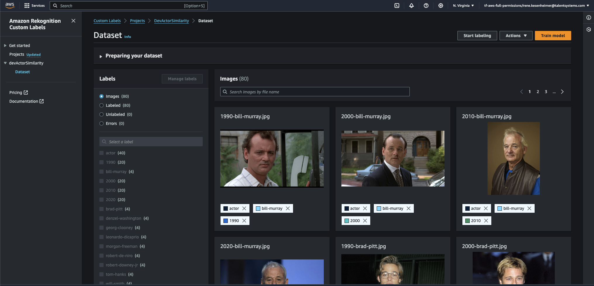

# Project: Actor Similarity Search
This project is dedicated to image classification of famous actors trying to find a actor profile that matches a famous actor for a given period e.g. "Show me similar profiles to the actor abc in year xyz". The periods are set for (1990, 2000, 2010, and 2020). In this project, AWS Rekognition is utilized to apply custom labels to a training data set. 

Currently we have the following famous actors and actresses are currently part of the training data set:

 - Actors:
    - Bill Murray
    - Brad Pitt
    - Denzel Washington
    - George Clooney
    - Leonardo DiCaprio
    - Morgan Freeman
    - Robert De Niro
    - Robert Downey Jr
    - Tom Hanks
    - Will Smith

- Actresses:
    - Alicia Witt
    - Angelina Jolie
    - Charlize Theron
    - Drew Barrymore
    - Eva Longoria
    - Jennifer Aniston
    - Julia Roberts
    - Linda Cardellini
    - Meryl Streep
    - Natalie Portman


## Data Pipeline
The data pipeline constists of a runner script within `data` that uses pictures uploaded to S3 and creates a dataset for a AWS Rekognition project. 

### Setup
Ensure you are in the `poc__rekogn_actor_search` project folder. Then install dependencies from pipenv via:
```bash
pipenv install -d
pipenv install
```

Ensure there is no existing AWS Rekognition Project with the same name. The pipeline can be run via:

```bash
pipenv run python3 data/run.py
```


### Dataset preview

